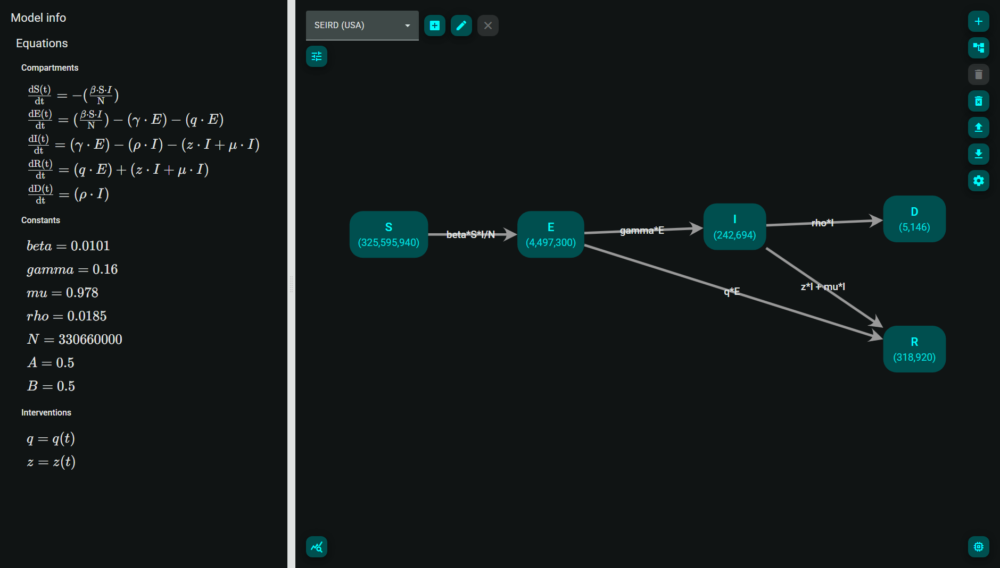

# CompLab: Compartmental Model Constructor & Analyzer

---



CompLab is an interactive, visual and intuitive constructor of compartmental mathematical models with set of auxiliary tools.

# Features

**TBD**

---

# Documentation

---

For detailed user guide and software description, please refer to [Wiki](https://github.com/why-not-dev/comp-lab/wiki).

# Roadmap

**TBD**

---

# Debugging in VS Code

---

## Prerequisites

- [Google Chrome](https://www.google.com/chrome/)
- [Visual Studio Code](https://code.visualstudio.com)
- [Git](https://git-scm.com)
- [Node.js](https://nodejs.org)
- [Python](https://www.python.org)

## Setup Instructions

1.  **Clone the Repository**

    Open terminal and run:

    ```powershell
    git clone https://github.com/why-not-dev/comp-lab
    cd comp-lab
    ```

2.  **Install Dependencies**

    You can install the necessary dependencies for both Python and Node.js manually or using a provided installation script:

    ```powershell
    .\install-dependencies.ps1
    ```

3.  **Install the Python VS Code Extension**

    - Open VS Code.
    - Go to the **Extensions** tab.
    - Search for and install the **Python**.

4.  **Open the Repository in VS Code**

    - In VS Code, click on **File** > **Open Folder** and select repository folder.

5.  **Launch the Debugger**

    - Click on the **Run and Debug** tab in VS Code.
    - From the dropdown at the top, select **"Launch Project"**.
    - Click the green **Play** button to start the debugging session.

You can now set breakpoints, inspect variables, and step through the code in both environments.

**P.S.** Those instructions are for Windows. If you are using Linux - you probably know how to do it anyway

# License

---

All commits in this project, regardless of their creation date, are published under the terms of the GNU Affero General Public License Version 3.
